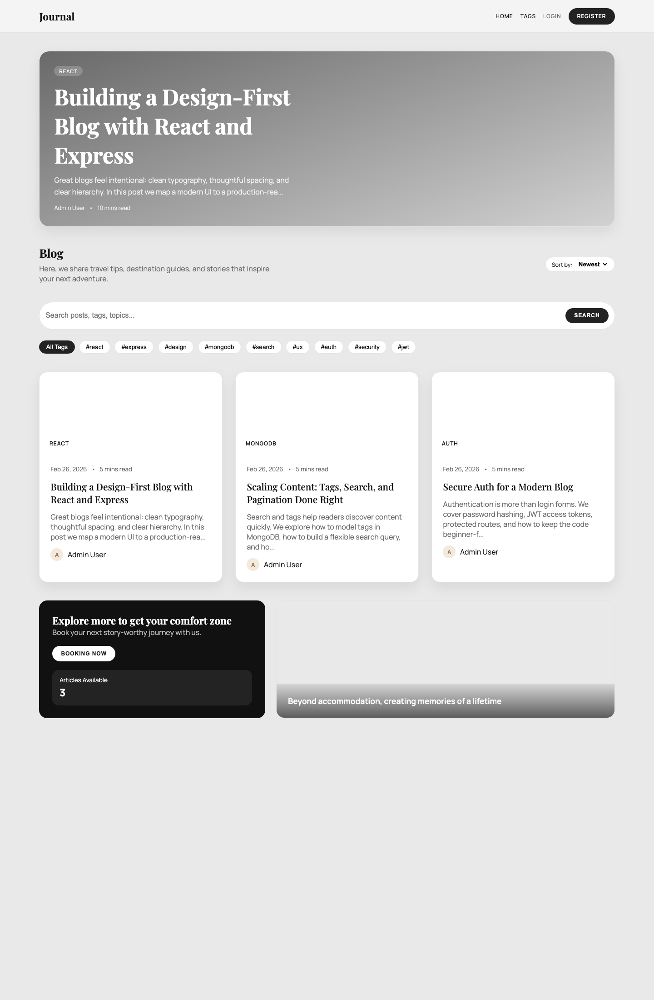
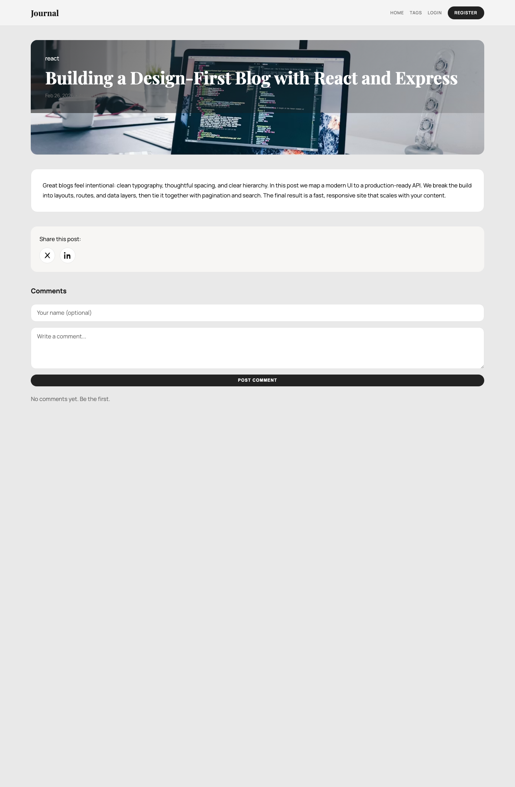
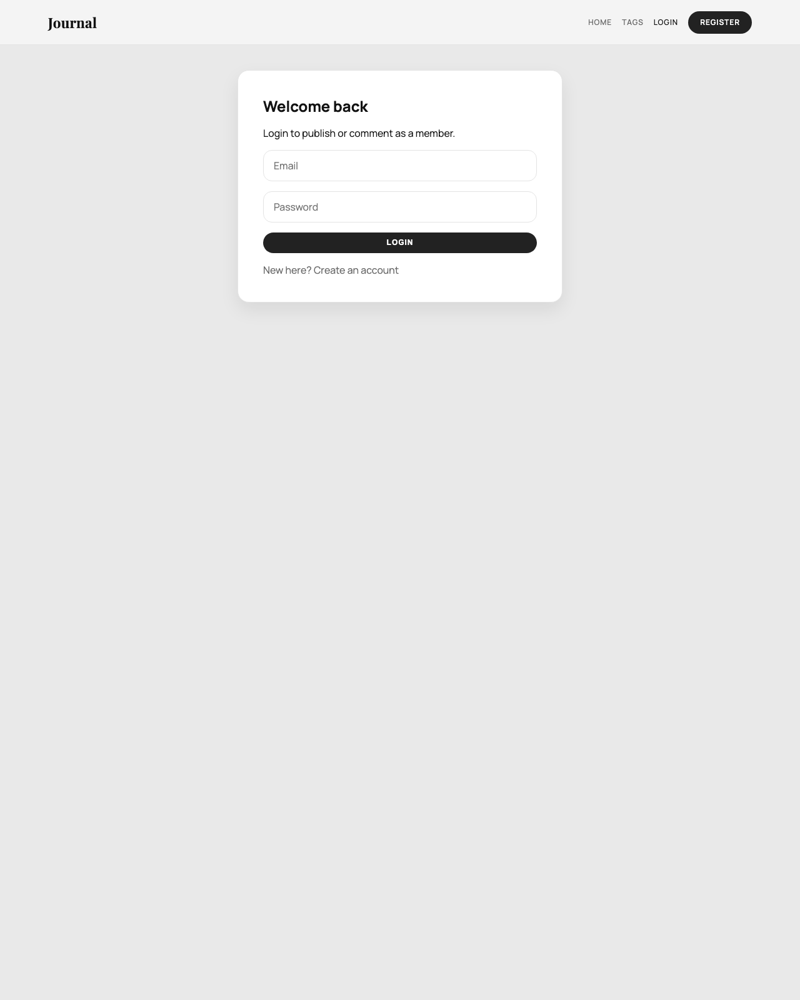
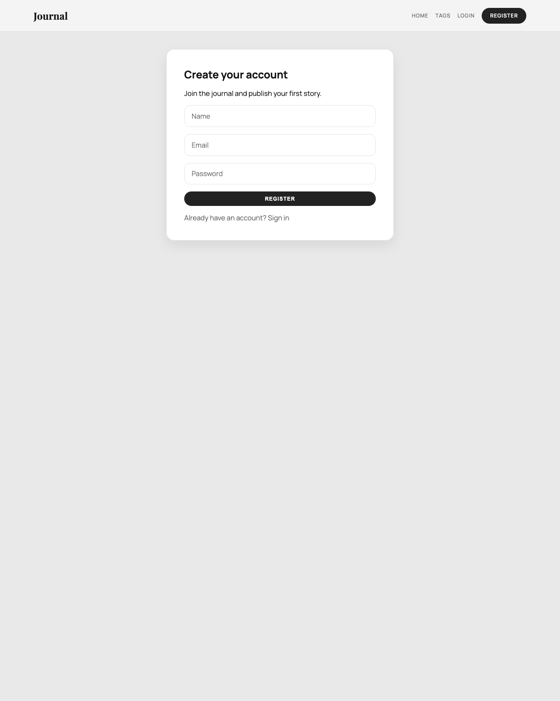
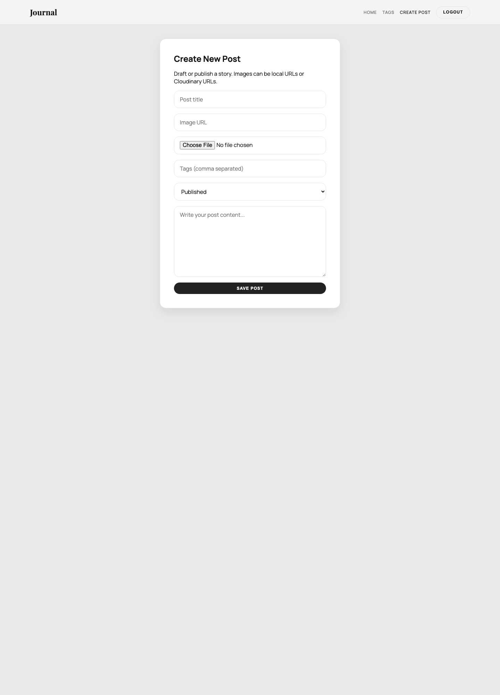
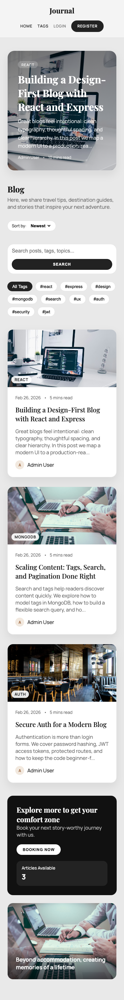

# Journal (Full-Stack Blog)

A production-style MERN blog with modern UI, JWT auth, search, tags, pagination, and real-time comments.

## Features
- Magazine-style, responsive UI inspired by modern blog layouts
- JWT auth (register/login) and protected post editor
- Posts list with search, tags filter, and pagination
- Post detail page with social share icons and instant comments
- Cloudinary image upload in the editor (optional)
- MongoDB seed script for demo content
- Secure API (helmet, rate limit, sanitize, validation)

## Tech Stack
- Frontend: React (Vite), React Router, Axios
- Backend: Node.js, Express
- Database: MongoDB + Mongoose
- Auth: JWT access token

## Project Structure
```
client/
  src/
    api/
    components/
    context/
    pages/
    styles/
    utils/
server/
  src/
    config/
    controllers/
    data/
    middleware/
    models/
    routes/
    utils/
    validators/
  seed.js
```

## Setup & Run
### 1) Backend
```
cd server
npm install
```

Create `/Users/riyadebnathdas/Desktop/Projects/Blog Website/server/.env`:
```
PORT=5001
MONGO_URI=mongodb://127.0.0.1:27017/blog-website
JWT_SECRET=replace_with_strong_secret
JWT_EXPIRES_IN=7d
CLIENT_ORIGIN=http://localhost:5173
CLOUDINARY_URL=cloudinary://<api_key>:<api_secret>@<cloud_name>
```

Run server:
```
npm run dev
```

The backend reads environment variables from `/Users/riyadebnathdas/Desktop/Projects/Blog Website/server/.env`, so it can start correctly whether you launch it from `server/` or from the project root.

### 2) Seed Demo Data
```
cd server
npm run seed
```

The seed script uses the same `/Users/riyadebnathdas/Desktop/Projects/Blog Website/server/.env` file.

Default admin user:
- Email: admin@example.com
- Password: Password123!

### 3) Frontend
```
cd client
npm install
```

Create `/Users/riyadebnathdas/Desktop/Projects/Blog Website/client/.env`:
```
VITE_API_URL=http://localhost:5001/api
```

Run client:
```
npm run dev
```

Open http://localhost:5173

## Environment Variables
Already listed above in Setup.

## Screenshots
### Home (Desktop)


### Post Details + Comments


### Login


### Register


### Editor (Protected)


### Home (Mobile)


## Resume Project Description (3–5 bullets)
- Built a full-stack MERN blog platform with JWT auth, protected post editor, and MongoDB data models for users, posts, and comments.
- Designed a magazine-style, responsive UI in React with search, tag filters, pagination, and instant comment updates.
- Implemented a production-ready Express API using MVC structure, input validation, and security middleware (helmet, rate limiting, sanitization).
- Added Cloudinary uploads and seed scripts for consistent local development and demos.

## Interview Questions & Answers (10)
1. **How did you structure the backend API?**
   - I used an MVC pattern: routes map to controllers, controllers call Mongoose models, and common logic lives in middleware and utils.
2. **Why use JWT access tokens?**
   - JWTs keep the API stateless and allow protected routes without server sessions, which scales well for APIs.
3. **How does search work?**
   - The posts endpoint accepts a `search` query param and uses case-insensitive regex on title and content.
4. **How did you handle tags filtering?**
   - Tags are stored as an array in MongoDB. The API filters with `$in` based on a `tags` param.
5. **How is pagination implemented?**
   - The API accepts `page` and `limit`, uses `skip` and `limit`, and returns pagination metadata.
6. **How did you secure the API?**
   - Added helmet, rate limiting, Mongo sanitization, validation, and JWT-protected routes.
7. **How are comments handled?**
   - Comments are stored in a separate collection with a `post` reference and can be added by guests or logged-in users.
8. **What would you improve for production?**
   - Add refresh tokens, roles for admin/editor, full-text search indexes, and better image moderation.
9. **How does the editor work?**
   - The editor is a protected page that creates or updates posts via the REST API.
10. **What did you optimize for in the UI?**
   - Readability and clarity: large typography, strong hierarchy, and responsive layout for mobile and desktop.

## Build
```
cd client
npm run build
```

## Deployment
- Backend is deployed on Railway from the GitHub repo.
- Live API base URL: `https://api-production-efaf.up.railway.app`
- Health check: `https://api-production-efaf.up.railway.app/api/health`
- Railway service uses port `5001`.
- Update `CLIENT_ORIGIN` in Railway when the frontend is deployed, otherwise CORS will continue allowing only the local frontend origin.

## Notes
- Cloudinary upload is optional. If `CLOUDINARY_URL` is set, the editor can upload images.
- API base URL is controlled via `VITE_API_URL`.
